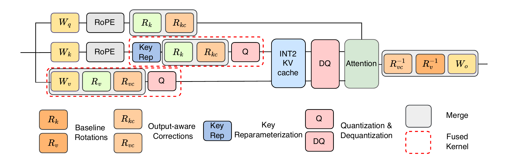

# Output-Aware Rotation for INT2 KV-Cache Quantization

This is the official implementation of **OptR: Output-Aware Rotation for INT2
KV-Cache Quantization**. The repository contains calibration, serving, and
evaluation code for Qwen3-4B-Thinking-2507, Qwen3-8B, and
Phi-4-reasoning-plus.

## Overview

OptR learns model-specific key and value rotations from a small set of
full-precision QKV traces while keeping all model weights frozen. The resulting
artifacts are applied by the bundled SGLang runtime during INT2 KV-cache
inference.

The evaluation code covers the five benchmarks used in the main experiments:
AIME 2024, AIME 2025, GPQA Diamond, MBPP+, and LiveCodeBench v6.



## Results

| Model | Method | BPE | AIME24 | AIME25 | GPQA | MBPP+ | LCB v6 | Mean |
|---|---|---:|---:|---:|---:|---:|---:|---:|
| Qwen3-4B-Thinking-2507 | BF16 | 16 | 78.00 | 71.33 | 64.55 | 77.31 | 46.71 | 67.58 |
|  | TurboQuant (no MP) | 3.25 | 10.00 | 16.67 | 41.92 | 23.02 | 1.71 | 18.66 |
|  | QuaRot-INT2 | 2.32 | 0.00 | 0.00 | 6.06 | 5.61 | 1.37 | 2.61 |
|  | QuaRot-INT2 + **OptR** | 2.32 | 69.33 | 60.67 | 62.12 | **78.31** | 37.71 | 61.63 |
|  | OSCAR | 2.32 | 68.67 | 63.33 | 62.02 | 75.66 | 43.89 | 62.71 |
|  | OSCAR + **OptR** | 2.32 | **72.00** | **70.67** | **62.83** | 76.83 | **44.57** | **65.38** |
| Qwen3-8B | BF16 | 16 | 76.00 | 68.00 | 55.76 | 79.15 | 49.37 | 65.66 |
|  | TurboQuant (no MP) | 3.25 | 53.33 | 40.00 | 45.96 | 58.99 | 21.14 | 43.88 |
|  | QuaRot-INT2 | 2.32 | 16.00 | 17.33 | 42.12 | 49.10 | 5.26 | 25.96 |
|  | QuaRot-INT2 + **OptR** | 2.32 | 76.00 | **66.67** | 57.58 | **80.63** | 39.77 | 64.13 |
|  | OSCAR | 2.32 | 72.00 | 54.67 | 56.26 | 78.73 | 45.03 | 61.34 |
|  | OSCAR + **OptR** | 2.32 | **76.67** | 66.00 | **58.99** | 79.21 | **47.54** | **65.68** |
| Phi4-14B-reasoning-plus | BF16 | 16 | 70.00 | 60.67 | 45.56 | 77.18 | 39.43 | 58.57 |
|  | TurboQuant (no MP) | 3.25 | 60.00 | 53.33 | 46.97 | 74.60 | 33.14 | 53.61 |
|  | QuaRot-INT2 | 2.32 | 61.33 | 46.00 | 46.77 | 75.82 | 34.97 | 52.98 |
|  | QuaRot-INT2 + **OptR** | 2.32 | 64.00 | 52.00 | **47.58** | **76.70** | **36.00** | 55.26 |
|  | OSCAR | 2.32 | 62.67 | 49.33 | 43.84 | 73.02 | 34.29 | 52.63 |
|  | OSCAR + **OptR** | 2.32 | **65.33** | **58.00** | 46.16 | 73.44 | 35.09 | **55.60** |

Results are averaged over five seeds. TurboQuant results are from a single run.
BPE denotes the effective number of bits per KV-cache element.

## Example Commands

### Setup

```bash
sudo apt-get update
sudo apt-get install -y build-essential libnuma1

python3.11 -m venv .venv
source .venv/bin/activate
bash setup.sh
```

### Calibration

```bash
bash scripts/qwen3-8b.sh prepare
bash scripts/qwen3-8b.sh calibrate all
```

### Evaluation

```bash
# One benchmark
SEEDS=5 bash scripts/qwen3-8b.sh eval oscar_optr aime25

# All five benchmarks
SEEDS=5 bash scripts/qwen3-8b.sh eval-all oscar_optr
```

Use `bf16`, `naive_int2`, `quarot`, `quarot_optr`, `oscar`, or `oscar_optr`
as the evaluation mode. The benchmark keys are `aime24`, `aime25`, `gpqa`,
`mbpp_plus`, and `lcb_v6`. For the other models, replace `qwen3-8b.sh` with
`qwen3-4b-thinking-2507.sh` or `phi-4-reasoning-plus.sh`.

## Note

- OptR requires Linux, Python 3.11 or newer, NVIDIA GPUs, and the CUDA 12.x
  Toolkit including `nvcc`. Model scripts use eight GPUs by default.
- Model weights are downloaded from Hugging Face on first use. Setting
  `HF_TOKEN` is recommended.
- INT2 evaluation requires the model-specific artifacts produced by the
  calibration commands under `artifacts/<model-tag>/`.
- LiveCodeBench requires Docker or Podman. MBPP+ should be run in a disposable
  environment.
- Dependencies and benchmark data are versioned in `requirements.txt` and
  `eval/data_manifest.json`.
- OptR is released under the Apache License 2.0. Bundled third-party code
  retains its original license.

## Citation

This repository is built on the official OSCAR codebase.

```bibtex
@article{zhou2026oscar,
  title={OSCAR: Offline Spectral Covariance-Aware Rotation for 2-bit KV Cache Quantization},
  author={Zhou, Zhongzhu and Zhuang, Donglin and Li, Jisen and Chen, Ziyan and Song, Shuaiwen Leon and Athiwaratkun, Ben and Wu, Xiaoxia},
  journal={arXiv preprint arXiv:2605.17757},
  year={2026}
}
```
